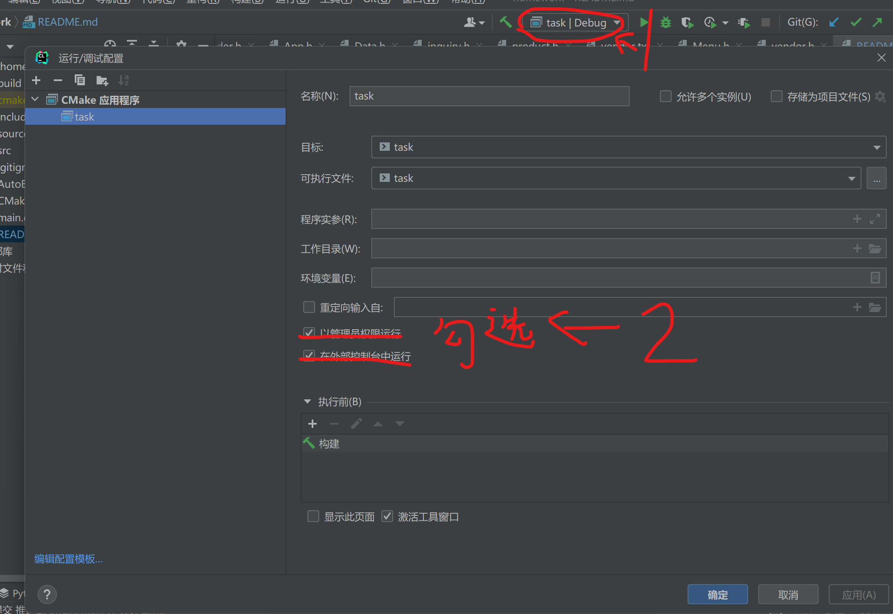
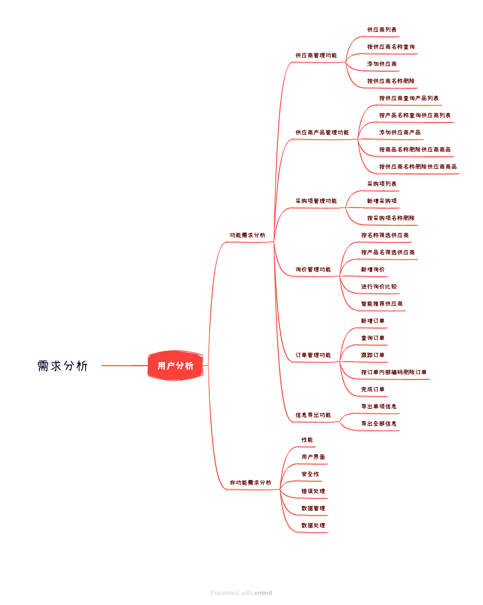
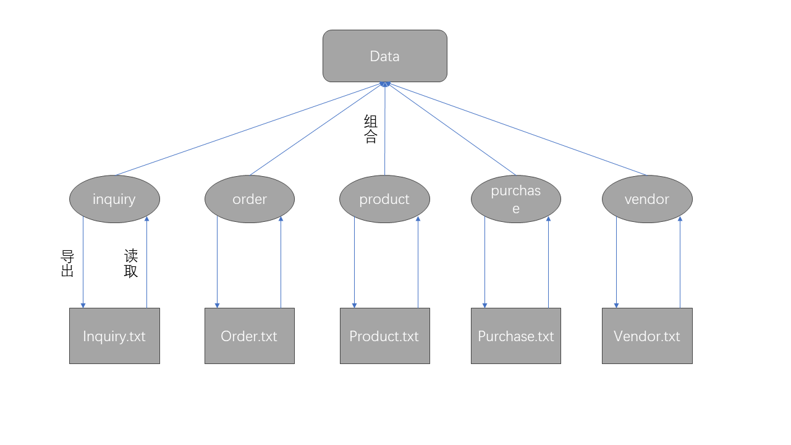

# 编译运行

```shell
cd ./cpphomework
chmod +x AutoBuild.sh
./AutoBuild.sh
```

# 提醒
1. cin默认编码是GBK，如果输入中文，需要设置文件编码为GBK，保持一致，否则会出现乱码。
2. make编译选项中，添加-fexec-charset=GBK -finput-charset=GBK，保证编译器编译时使用GBK编码。
3. VS中请将Data类实例化出的data更改为其他名字，msvc编译器里也有一个data，命名冲突。
4. clion中，请使用外部控制台运行程序，否则会出现乱码。如下图所示：
5. 请不要使用msvc编译器，应该是命名空间的问题，不让变量命名为data，算了，就用gcc吧，windows里用MinGW（里面是gcc编译器）。


# 需求分析


# 代码框架
```txt
.
├── CMakeLists.txt：cmake文件
├── README.assets；存放 README.md 图片
├── README.md：本文档
├── AutoBuild.sh：编译脚本
├── main：main：主程序，项目入口
├── src：源代码
│   ├── APP.cpp：应用程序初始化和运行框架
│   ├── Data.cpp：存放Data类的实现
│   ├── MenuMgr.cpp: 菜单管理器的单例获取和析构函数
│   ├── Menu.cpp: 菜单类的实现
│   ├── MenuFactory.cpp: 菜单工厂类的实现
│   ├── order.cpp: 存放订单类的实现
│   ├── inquiry.cpp：存放询价管理类的实现
│   ├── product.cpp: 存放产品类的实现
│   ├── purchase.cpp: 存放采购项类的实现
│   └── vendor.cpp: 存放供应商类的实现
├── include: 头文件
│   ├── APP.h: 应用程序初始化和运行框架类
│   ├── Data.h: 存放Data类的声明
│   ├── FileExample.h: 文件操作（读取与分割，不包含导出，导出的实现在Data类里）
│   ├── Utils.h: 定义了两个宏，简化cout
│   ├── MenuMgr.cpp: 菜单管理器的声明   
│   ├── Menu.cpp: 菜单类的声明
│   ├── MenuFactory.cpp: 菜单工厂类的声明
│   ├── order.cpp: 存放订单类的声明与部分实现    
│   ├── inquiry.cpp：存放询价管理类的声明与部分实现
│   ├── product.cpp: 存放产品类声明与部分实现
│   ├── purchase.cpp: 存放采购项类的声明与部分实现
│   └── vendor.cpp: 存放供应商类的声明与部分实现
└── source: 数据资源文件
          ├── order.txt: 订单数据
          ├── inquiry.cpp：询价数据
          ├── product.cpp: 产品数据
          ├── purchase.cpp: 采购项数据
          └── vendor.cpp: 供应商数据
```
# 人员分工

赵隽博：系统设计与框架设计

陈  冲：部分功能实现

阎  志：功能拓展与验证


# 框架介绍



# 存在待改进的问题
1. 应该创建一个接口类。因为5个txt文件的功能类似，可以有一个共同的父类，以便实现多态。
   （当时写的时候想的没那么多，没有事先设计好。看到题目直接开始写，看到几个txt文件就写了几个类，写完了才发现有点烂，但已经不想改了）


